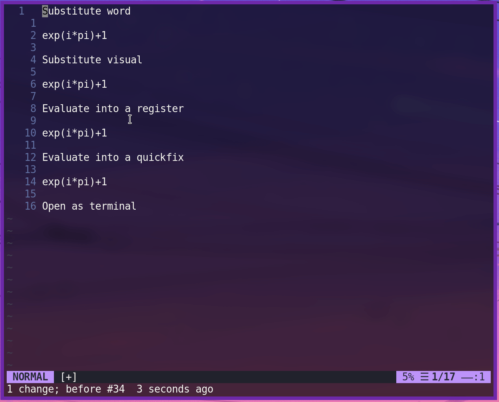

# vim-qalc

Simple integration with `qalc` for vim, to make calculations easier



## Installation

Use your favourite plugin manager. For example with
[Vundle.vim](https://github.com/VundleVim/Vundle.vim):
```vimscript
Plugin 'eleanor-clifford/vim-qalc'
```
# Dependencies

- libqalculate

Optional:

- [skywind3000/asyncrun.vim](https://github.com/skywind3000/asyncrun.vim) to
  enable evaluating an expression into a quickfix window

# Usage

You can evaluate expressions in a few ways. Here are the default mappings
(disabled with `let g:qalc_mappings = 0`). Note that the terminal and quickfix
options only work with vim (not neovim) at the moment.

```vimscript
" Run the selection into a quickfix window (requires AsyncRun)
vnoremap <leader>xq :call qalc#ToQuickfix()<CR>
" Evaluate the selection and put it in the active register
vnoremap <leader>xr :call qalc#ToRegister(v:register)<CR>
" Evaluate the selection and replace it
vnoremap <leader>xs :call qalc#Substitute()<CR>
" Evaluate and overwrite the current word (cannot contain a space!)
nnoremap <leader>x<leader> viW:call qalc#Substitute()<CR>
" Evaluate the current word and put it in the " register
nnoremap <leader>xx viW"":call qalc#ToRegister(v:register)<CR>
" Open qalc in a terminal window
noremap <leader>xt :term ++close qalc<CR>
```
